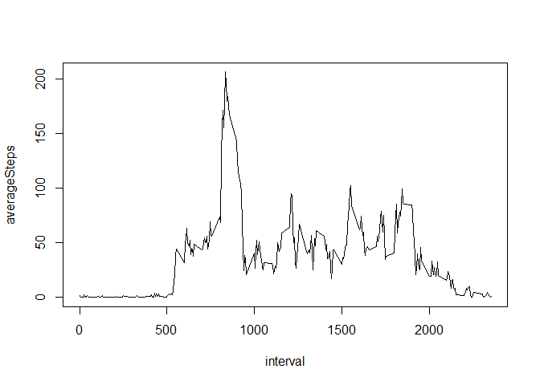

# Reproducible Research: Peer Assessment 1


## Loading and preprocessing the data


First we need to download files by this url and unzip it (if it's not exist in the current folder)

```r
fileName <- "activity"
if (!file.exists(paste0(fileName, ".csv"))){
    dataUrl <- "https://d396qusza40orc.cloudfront.net/repdata%2Fdata%2Factivity.zip"
    download.file(dataUrl, paste0(fileName, ".zip"))
    unzip(paste0(fileName, ".zip"))
}
```

Read files. Today I just find out that we can read directly from zip files

```r
data <- read.csv(paste0(fileName, ".csv"))

library(dplyr)
```

```
## 
## Attaching package: 'dplyr'
```

```
## The following objects are masked from 'package:stats':
## 
##     filter, lag
```

```
## The following objects are masked from 'package:base':
## 
##     intersect, setdiff, setequal, union
```

```r
data2 <- tbl_df(data)
```

We can look at the data:

```r
data2
```

```
## # A tibble: 17,568 × 3
##    steps       date interval
##    <int>     <fctr>    <int>
## 1     NA 2012-10-01        0
## 2     NA 2012-10-01        5
## 3     NA 2012-10-01       10
## 4     NA 2012-10-01       15
## 5     NA 2012-10-01       20
## 6     NA 2012-10-01       25
## 7     NA 2012-10-01       30
## 8     NA 2012-10-01       35
## 9     NA 2012-10-01       40
## 10    NA 2012-10-01       45
## # ... with 17,558 more rows
```


## What is mean total number of steps taken per day?


First, we need group data by date:

```r
dataGrouped <- group_by(data2, date)
```

Now we can summarize data by date:

```r
totalSteps <- summarise(dataGrouped, 
                        totalSteps = sum(steps, na.rm = T))
```

This is a histogram (with rug) of the total number of steps taken each day:

```r
hist(totalSteps$totalSteps, breaks = 20, 
     main="Total number of steps taken each day",
     xlab="Total Steps")
rug(totalSteps$totalSteps)
```

<!-- -->

We can see that a lot of days don't have steps data.  

* Days with zero steps : 8   

If there is data, then amount of steps per day stars from about 2500.   
Most of days have 10000-11000 steps. 

Summary of this data is:

```r
summaryTotalSteps <-summary(totalSteps$totalSteps)
summaryTotalSteps
```

```
##    Min. 1st Qu.  Median    Mean 3rd Qu.    Max. 
##       0    6778   10400    9354   12810   21190
```

So, we can see that:

* **Median** = 10400
* **Mean** = 9354
    

## What is the average daily activity pattern?


First group by intervals:


```r
dataGroupedIntervals <- group_by(data2, interval)
```

Now find average numbers of steps

```r
averageStepsByInervals <- summarise(dataGroupedIntervals,
                                    averageSteps = mean(steps, na.rm = T))
with(averageStepsByInervals, plot(interval, averageSteps, type="l"))
```

<!-- -->

####Which 5-minute interval, on average across all the days in the dataset, contains the maximum number of steps?


```r
maxSteps <- which.max(averageStepsByInervals$averageSteps)
timeMaxSteps <- averageStepsByInervals[maxSteps, "interval"]
```

* Maximum number of steps in inerval:  8:35


## Imputing missing values


####Calculate and report the total number of missing values in the dataset (i.e. the total number of rows with NAs)


```r
missingValueCount <- sum(is.na(data2$steps))
```

* Count of missing value = 2304

##### 2. Devise a strategy for filling in all of the missing values in the dataset.
For imputting data I will use impute funciton from library Hmisc. 

```r
library(Hmisc)
```

```
## Loading required package: lattice
```

```
## Loading required package: survival
```

```
## Loading required package: Formula
```

```
## Loading required package: ggplot2
```

```
## 
## Attaching package: 'Hmisc'
```

```
## The following objects are masked from 'package:dplyr':
## 
##     combine, src, summarize
```

```
## The following objects are masked from 'package:base':
## 
##     format.pval, round.POSIXt, trunc.POSIXt, units
```

I will use mean function to imput missing values.

##### 3. Create a new dataset that is equal to the original dataset but with the missing data filled in.


```r
dataImputed <- data2
dataImputed$steps <- impute(data2$steps, fun=mean)
```

Now will check do we have missing values or not:


```r
missingValueCount <- sum(is.na(dataImputed$steps))
```

* Count of missing value after imputing = 0 

####Make a histogram of the total number of steps taken each day and Calculate and report the mean and median total number of steps taken per day. 

This is a histogram (with rug) of the total number of steps taken each day:

```r
dataGrouped2 <- group_by(dataImputed, date)
totalSteps2 <- summarise(dataGrouped2, 
                        totalSteps = sum(steps, na.rm = T))
hist(totalSteps2$totalSteps, breaks = 20, 
     main="Total number of steps taken each day",
     xlab="Total Steps")
rug(totalSteps2$totalSteps)
```

<!-- -->

####Do these values differ from the estimates from the first part of the assignment? 
Yes, values are differ.

####What is the impact of imputing missing data on the estimates of the total daily number of steps?

All missing data are filled up with mean data. We can see it by using this code:

```r
totalSteps2$totalSteps[totalSteps$totalSteps == 0]
```

```
## [1] 10766.19 10766.19 10766.19 10766.19 10766.19 10766.19 10766.19 10766.19
```

####Summary of this data is:

```r
summaryTotalSteps2 <-summary(totalSteps2$totalSteps)
summaryTotalSteps2
```

```
##    Min. 1st Qu.  Median    Mean 3rd Qu.    Max. 
##      41    9819   10770   10770   12810   21190
```

So, we can see that:

* **Median** = 10770
* **Mean** = 10770


## Are there differences in activity patterns between weekdays and weekends?


####Create a new factor variable in the dataset with two levels - "weekday" and "weekend" indicating whether a given date is a weekday or weekend day.


```r
dataImputed$dateType <- ifelse(
        as.POSIXlt(dataImputed$date)$wday %in% c(0,6), 
        'weekend', 'weekday')
```


####Make a panel plot containing a time series plot


```r
averageDataImputed <- aggregate(steps ~ interval + dateType, 
                                data=dataImputed, mean)
ggplot(averageDataImputed, aes(interval, steps)) + 
    geom_line() + 
    facet_grid(dateType ~ .) +
    xlab("5-minute interval") + 
    ylab("avarage number of steps")
```

<!-- -->

We can see, on weekends there is more steps during a day
